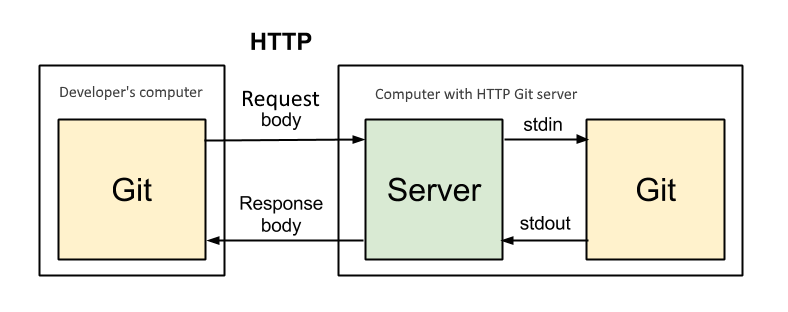

# GitServer

Own ASP.NET Core 2.2 Git HTTP Server

Setting

```
  "GitSettings": {
    "BasePath": "E:\\GitServerRepos",
    "GitPath": "git"
  }
```

GitPath can be an absolute path to git like в Windows: **C:\Program Files\Git\bin\git.exe**

Need to install [Git](https://git-scm.com/) first, and make sure the git command can be executed

`git version`

## Features

### Сompleted

- Create a repository
- Browse the repository
- git client: push pull
- Supported Databases: SQLite | MSSQL | MySQL
- User support for repositories

## Development

`git clone https://github.com/InfDev/GitServer.git`

Use VS 2017 15.9+ or VS Code 1.28+.

If it is necessary to update client resources (folder _./GitServer/assets_), you must have the installed [node.js](https://nodejs.org/en/). Then, being in the repository folder, you need to run install the gulp-tools:

```cmd
> cd ./GitServer
> npm install
```

Client libraries (_semantic_ with _jquery_) can be upgraded to newer versions:

```cmd
> bower install
```

After changing your own client resources (js, css, img in assets folder), you must run:

```
> npm run build
```

## working principle

git client → GitServer → git server



## License

This project is under the [MIT License](LICENSE).
